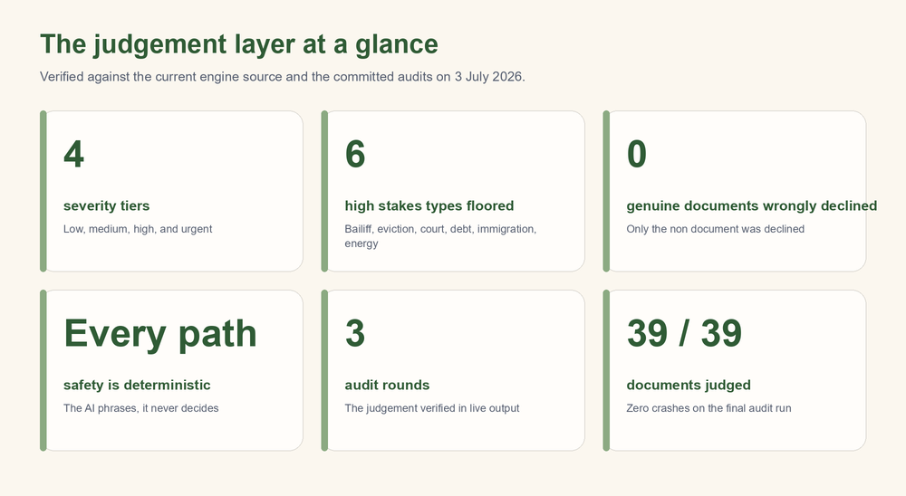

# The Northcue Trust and Severity System

### Investor Edition

*Prepared for investors and institutional partners. Every claim below is drawn from the current engine source and the committed audit reports, and was verified against that evidence on 3 July 2026. This document explains the concepts and principles of Northcue's judgement layer. It deliberately does not reproduce the internal phrase tables or exhaustive detection lists, and gives only a small number of illustrative examples. This is a rigorous explanation, not marketing material. This edition adds a visual summary to the verified record; no claim has been changed or weakened.*

---

## 1. Executive summary

The Northcue judgement layer is the part of the system that decides what a document appears to be, how serious it is, whether it looks genuine, and when Northcue should refuse to proceed. It exists because the people Northcue is built for, who may be anxious, overwhelmed, neurodivergent, or reading official language under stress, cannot safely be given a confident wrong answer. So the layer is built to be cautious, honest, and two sided: it must not reassure someone about a serious letter, and it must not frighten someone about a routine one. It reaches its conclusions in a deterministic rules layer that behaves identically on every run, and it presents them in calm, hedged language that admits uncertainty rather than guessing. This layer, not the phrasing that sits on top of it, is where the product's care actually lives.

---

## 2. What the system decides

For every upload, the judgement layer produces a small set of structured conclusions before any cue card is written.

- **Document category.** What the document appears to be, for example a bill or payment, a benefits letter, a health letter, a housing letter, a legal or court letter, a government letter, or an appointment. When nothing fits, the category is honestly left as unknown rather than forced.
- **Severity.** How serious the document appears, on four tiers: low, medium, high, and urgent. Severity drives how firmly the result is worded and which banner is shown.
- **Trust assessment.** Whether the document looks genuine, on four levels: high, medium, low, and unknown. This is formed by weighing authenticity signals, the markers a real letter tends to carry, against distrust and scam signals, the pressure and credential patterns a fraudulent message tends to carry. When the text is too poor to read, trust is honestly unknown.
- **Processing mode.** How the document should be handled: the normal path, a cautious path, a verification only path for suspected fraud, or an unsupported path for input that cannot be read or is not an official document.
- **Input quality.** Whether the extracted text is good, borderline, or poor, which governs how confidently anything is stated and whether the AI phrasing step is allowed to run at all.
- **The banner.** A single calm sentence and a state that communicate the overall judgement to the reader at a glance, without alarm.

These conclusions are computed first, and everything the user sees is built from them.

---

## 3. Design principles

This section is the heart of the system. The judgement layer is shaped by five principles, and each one is visible in the audit evidence.

### 3a. Two sided safety

The layer is designed to fail safely in both directions, because both directions are real harms. If a serious letter is reassured as normal, a vulnerable person may miss a genuine deadline. If a routine letter is treated as alarming, a person may be frightened for no reason. Two illustrations from the audits make this concrete.

- In the first direction, a bailiff enforcement notice was originally rated low and shown a reassuring banner that said it looked like a normal document. That is exactly the kind of quiet, calmly worded but serious letter that must not be reassured, and it is now correctly raised to the most serious tier with a careful banner.
- In the other direction, a routine direct debit confirmation was originally miscategorised as a legal or court letter, because the recipient's home address happened to contain the word court, as in a street named Sycamore Court. That false alarm was removed by requiring genuine court phrasing rather than the bare word, and the routine letter is now handled as an ordinary document.

The same care that stops a serious letter being reassured also stops a street name turning an ordinary letter into a frightening one.

### 3b. The stakes floor

A central insight behind the system is that real serious letters are usually written calmly. A bailiff notice, an eviction notice, or a court claim does not shout. It uses measured, procedural language. A system that judged seriousness only from tone would therefore be most likely to under alarm exactly the documents where under alarming is most dangerous.

Northcue addresses this with a stakes floor. Certain genuinely high stakes document types, such as enforcement and bailiff action, eviction and possession, court claims, debt collection, immigration refusal, and energy supply disconnection, are recognised by the substance of what they describe, and are held at or above a serious severity regardless of how gentle their wording is. The floor can only ever raise a severity, never lower it, so a calm tone can never talk a serious document down into a reassuring state. This is the mechanism that moved the bailiff notice, the eviction notice, the court claim, the debt collection letter, and the overdue disconnection warning out of the reassuring state and into a careful one.

### 3c. Refusal as a feature

A judgement layer that is honest must be willing to stop. Northcue treats refusal as a designed behaviour, not a failure, in two situations.

- **Suspected fraud.** When a message shows the patterns of a scam, for example pressure to act immediately combined with a request for account or card credentials, the document is routed to a verification only mode. In that mode the cue cards are drawn from a small set of fixed, safe templates that always say the same careful things: verify the organisation through its official website, use contact details from an official source, and protect your money and personal details. Crucially, the AI phrasing step is switched off entirely on this path, so the model can never restate the scam's own instructions in friendlier language. This directly addresses the most serious early finding, where a phishing letter had been echoed back as an instruction to confirm the reader's details.
- **Not an official document.** When an upload does not look like an official letter at all, for example a menu or a flyer, Northcue declines to turn it into cue cards and says so calmly. This gate is deliberately conservative: it declines only when the text is readable good quality, matched no category, and carries none of the markers a real letter almost always has, such as a sender, a reference, or a date. The asymmetry is intentional, because wrongly turning away a real letter would be worse than politely declining a menu. In testing across the full document set, exactly one item, the menu, was declined, and no genuine document was wrongly declined.

### 3d. Deterministic safety

Every safety decision in Northcue is made by the rules layer, and the rules layer is deterministic: given the same text it reaches the same judgement on every run and on every path. The AI phrasing step sits above this and can only rephrase. It cannot change the category, the severity, the trust level, or the banner, and it is prevented structurally from reintroducing unsafe content: a safety filter runs over the result before any decision to call or skip the AI, and the AI is skipped altogether for low quality, suspected scam, verification only, and non document uploads. The practical consequence is that the safety of the system does not depend on the AI behaving well or even running. A slow or failed phrasing call changes how fluent the cards read, never what the system judged or allowed.

### 3e. Honesty over confidence

The layer is built to prefer an honest uncertain answer to a confident guess. Its wording is hedged by design, using phrases such as appears to, may, and check the original document, so that nothing is asserted as fact that the system cannot see for certain. When it cannot determine the category, it says the document is of an unknown type rather than inventing one. When it cannot read the text, it says so and asks for a clearer copy rather than extracting possibly wrong details. This restraint is not a limitation bolted on afterwards. It is the point. The reader is always left with something to check, never an instruction to obey.

---

## 4. How the judgement reaches the user

The structured judgement is communicated through a single calm banner and a small, quiet panel, designed so that the meaning is never carried by colour alone.

The banner state maps to a calm visual state in the document check panel:

- A safe judgement becomes a reassuring routine state in soft green.
- A caution or urgent judgement becomes a careful state in soft amber, with the urgent case rendered slightly stronger than the caution case but still warm rather than alarming.
- A suspected fraud or low trust judgement becomes a gentle take care state in a soft, muted red, paired with please take care wording rather than anything frightening.

Colour is deliberately never the only signal. Each state also carries a short status word, a distinct icon, and the engine's own calm sentence, so that a reader who cannot distinguish the colours, or who is reading quickly under stress, still receives the full meaning from the text and the shape. The palette is kept soft and pastel throughout, so that even the most serious state reads as careful rather than as an emergency. The intent is that the visual never adds alarm that the words do not.

---

## 5. Evidence

The behaviour of the judgement layer was tested by running documents through the real pipeline and reading the actual output, across three committed audit rounds: an initial audit that found the issues, a mid point re run, and a final clean audit on the finished system. The judgement behaviours described above were confirmed in that live output: serious documents carry careful banners, the suspected scam sits in verification only mode with safe fixed cards, the county court claim is judged a legal letter, and the menu is declined.

Each change to the judgement layer was verified with a full set regression scan, in which the output of all 39 documents was compared before and after the change, so that only the intended documents were allowed to move. The energy disconnection change moved only the disconnection letter. The county court change moved only the court claim, while a genuine finance letter stayed a finance letter and the Sycamore Court letter was untouched. The non document change moved only the menu. In each case exactly one document changed, which is the evidence that the judgement was sharpened without disturbing anything else. In the final round all 39 documents were judged without a single crash.

---

## 6. Honest limits of the judgement layer

These limits are stated plainly, because a judgement layer that overstated its own reliability would betray the very people it is for.

- **Pattern matching has blind spots.** The layer reaches its conclusions largely by recognising words and phrases and the substance they signal. This is robust for the common shapes of UK official letters, but it can be fooled by unusual phrasing, and it can miss a serious document that describes itself in words the system does not yet recognise. The stakes floor reduces this risk for the known high stakes types, but it cannot cover a type it has not been taught.
- **Scam detection is a signal, not a guarantee.** The system catches the obvious and common patterns of fraud, and it fails safe by refusing to proceed when it sees them. It will not catch every novel or carefully disguised scam. For this reason Northcue does not claim to verify that a document is genuine. It offers a helpful judgement about whether something looks genuine, and it always tells the reader to verify through official channels rather than trusting that judgement as proof.
- **Garbled input limits the judgement.** When text arrives badly garbled, for example from a poor scan, some phrases the layer relies on may be broken and go unrecognised. The system fails safe here by flagging poor quality and asking for a clearer copy rather than guessing, but a garbled serious letter may not receive its full severity.
- **This is fictional input testing.** All of the evidence above comes from the system's real output on 39 fictional documents. It is not a substitute for testing with real people on their own real, messier documents. Whether the judgement actually helps an anxious or overwhelmed reader feel clearer and act safely can only be learned by observing real users.

---

## 7. Closing statement

The trust and severity system is the foundation of Northcue, because it is where the product decides how to treat a person who may be frightened by a letter they do not understand. It is genuinely hard to build well, not because any single rule is complex, but because it has to be right in two directions at once, honest about what it does not know, willing to refuse rather than guess, and calm at every point, while resting all of that on a deterministic core that behaves the same way every time rather than on a phrasing model that does not. That combination, a cautious two sided judgement layer that treats refusal and honesty as features and keeps every safety decision deterministic, is the part of Northcue that is careful by construction rather than by wording. It is the layer everything else is built on, and it is the part that would be hardest for anyone to reproduce responsibly.
